#  EIT-Website Projektstruktur

##  Gesamtübersicht

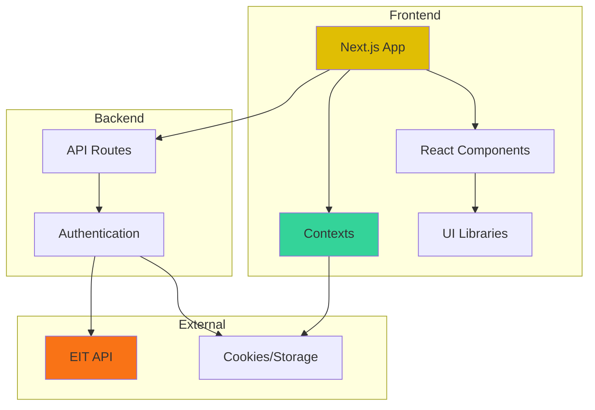

---

## 🔐 Authentication Flow

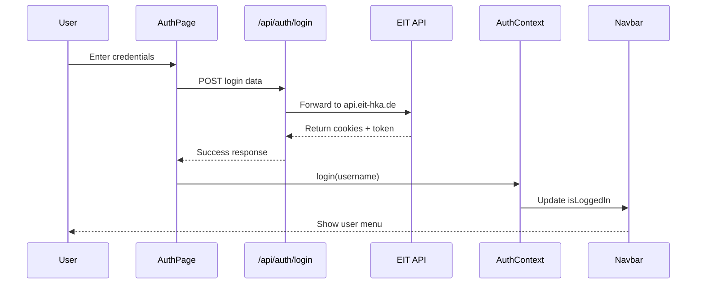

---

## 🎨 Theme System Flow

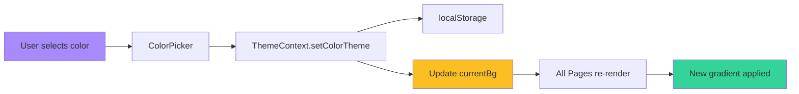

---

## 📁 Verzeichnisstruktur

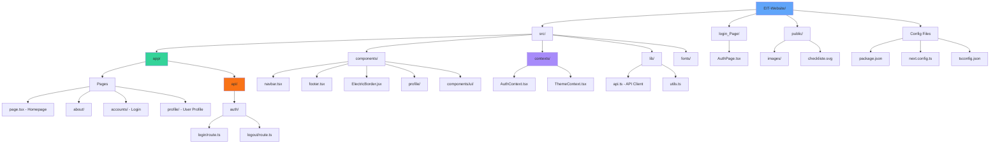

---

## 🔄 Component Hierarchie

```mermaid
graph TD
    LAYOUT[layout.tsx - Root]
    
    LAYOUT --> PROVIDERS[Providers]
    PROVIDERS --> THEME[ThemeProvider]
    PROVIDERS --> AUTH[AuthProvider]
    PROVIDERS --> HERO[HeroUIProvider]
    
    LAYOUT --> NAVBAR[NavBar]
    LAYOUT --> PAGE[Page Content]
    LAYOUT --> FOOTER[Footer]
    
    NAVBAR --> DROPDOWN[User Dropdown]
    DROPDOWN --> PROFILE_LINK[Profile Link]
    DROPDOWN --> LOGOUT[Logout Button]
    
    PAGE --> ACCOUNTS_PAGE[/accounts - AuthPage]
    PAGE --> PROFILE_PAGE[/profile - Profile Components]
    PAGE --> HOME_PAGE[/ - Homepage]
    
    ACCOUNTS_PAGE --> LOGIN_FORM[Login Form]
    ACCOUNTS_PAGE --> REGISTER_FORM[Register Form]
    
    PROFILE_PAGE --> PROFILE_CARD[ProfileCard]
    PROFILE_PAGE --> COLOR_PICKER[ColorPicker]
    PROFILE_PAGE --> PROJECTS[ProjectSection]
    PROFILE_PAGE --> CHECKLIST[StudyChecklist]
    PROFILE_PAGE --> SEMESTER[SemesterProgress]
    
    style LAYOUT fill:#60a5fa
    style PROVIDERS fill:#34d399
    style PAGE fill:#fbbf24
```

---

## 🔌 Context Abhängigkeiten

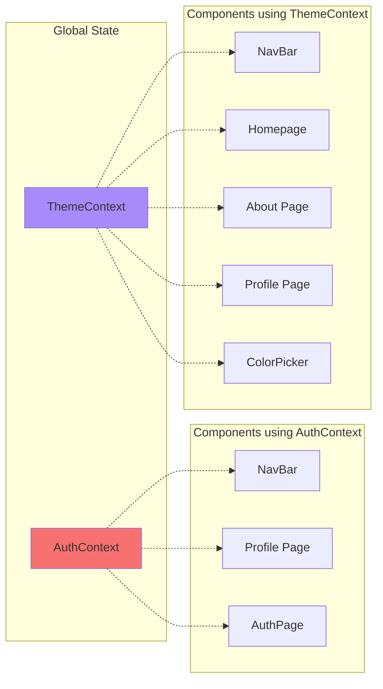

---

## 🚀 Data Flow - User Login

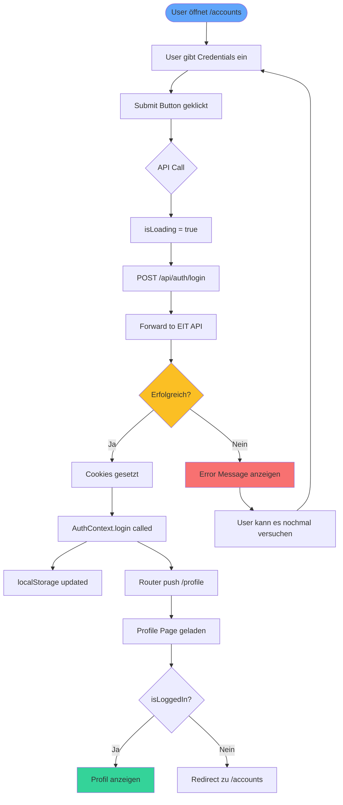

---

## 📦 Dependencies Overview

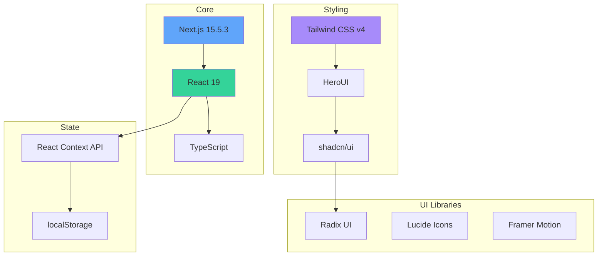

---

## 🎯 Route Structure

```mermaid
graph TD
    ROOT[/]
    
    ROOT --> HOME[page.tsx - Startseite]
    ROOT --> ABOUT[/about - Über uns]
    ROOT --> ACCOUNTS[/accounts - Login/Register]
    ROOT --> PROFILE[/profile - User Profil]
    ROOT --> TEAM[/team - Team Seite]
    ROOT --> VORTEILE[/vorteile_studenten]
    
    ROOT --> API_ROUTES[API Routes]
    API_ROUTES --> LOGIN_ROUTE[POST /api/auth/login]
    API_ROUTES --> LOGOUT_ROUTE[POST /api/auth/logout]
    
    ACCOUNTS --> AUTH_PAGE[AuthPage Component]
    
    PROFILE --> PROTECTED{isLoggedIn?}
    PROTECTED -->|Ja| PROFILE_CONTENT[Profile Content]
    PROTECTED -->|Nein| REDIRECT[Redirect /accounts]
    
    style ROOT fill:#60a5fa
    style PROFILE fill:#34d399
    style API_ROUTES fill:#f97316
```

---

## 🔧 API Integration

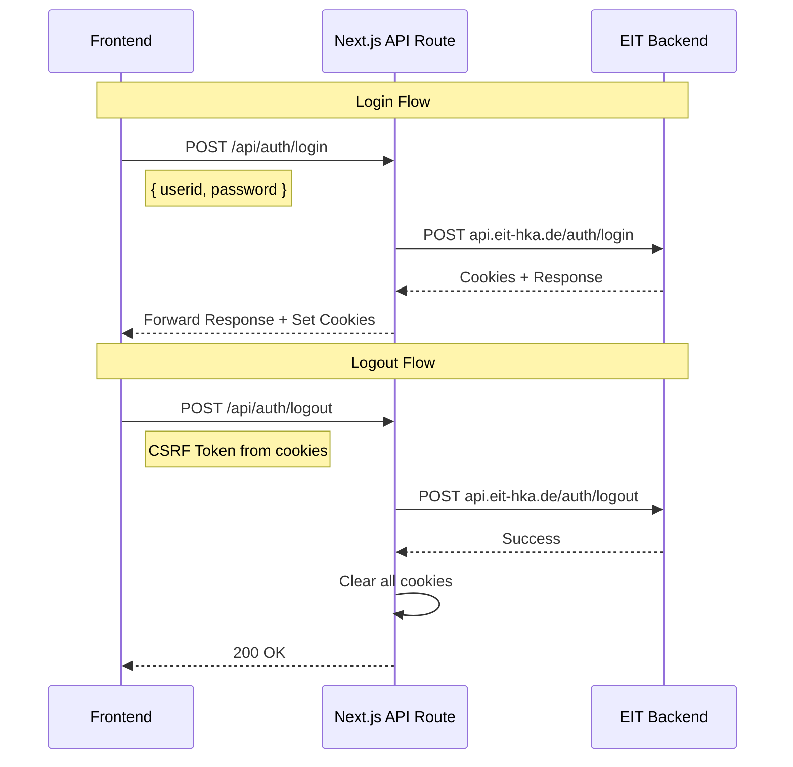

---

## 📈 Statistiken

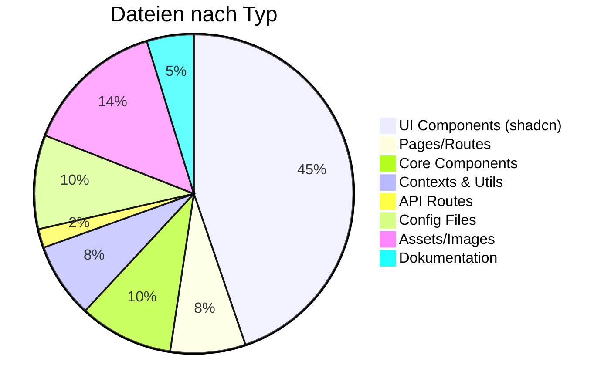

---

## 🎨 Theme System Details

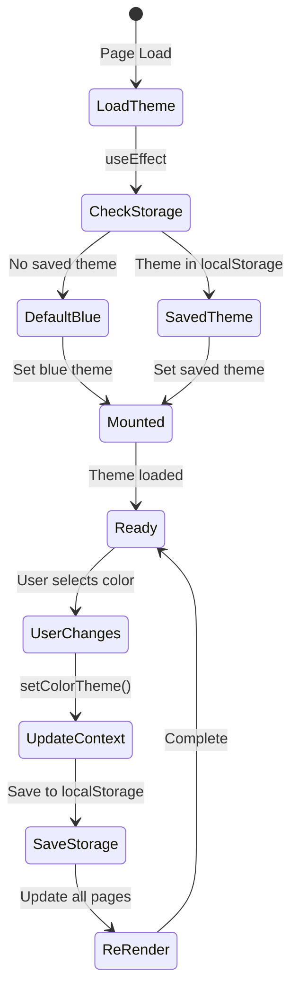

---

## 🛡️ Security Flow

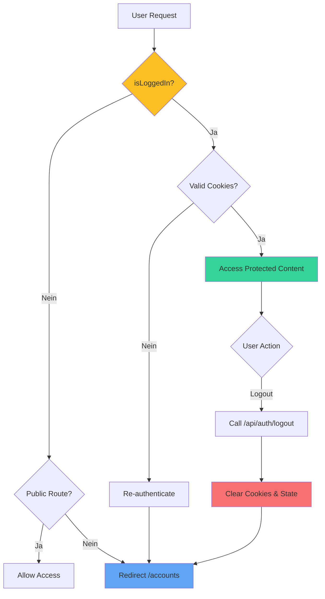